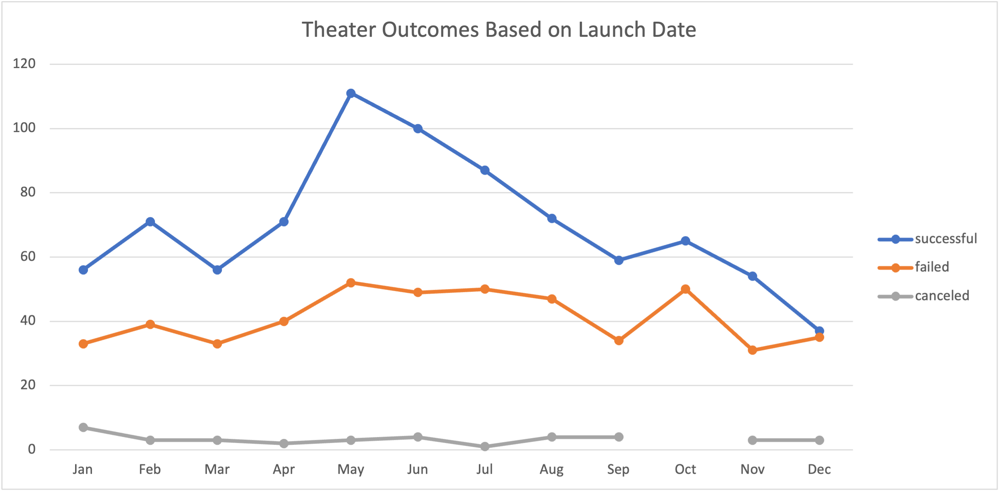
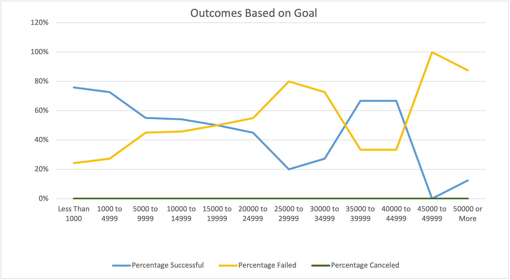

# kickstarter with Excel
Performing analysis on Kickstarter data to uncover trends

## Overview of Project

### Purpose
The purpose of this analysis is to learn how different campaigns have evolved in relation to their launch dates and funding goals. To do this, we look at trends.

## Analysis and Challenges

### Analysis of Outcomes Based on Launch Date

The month that launched the most successful Kickstarter campaigns was May. The month of May and June both have greater success rate. However, we can also see that May, June, July, August and October have roughly the same number of failed campaigns launched. This is determined by examining the points along the trend lines of the chart. The month of July has the least number of Cancelation. 

### Analysis of Outcomes Based on Goals

In general, we can see that when the goal range is small, the percentage Successful is higher and the percentage Failed is smaller, and when the goal range is higher, the percentage Successful is smaller and the percentage Failed is higher. The percentage Canceled remains null in those two scenarios. 

### Challenges and Difficulties Encountered
Challenges and difficulties encountered were mostly how to manipulate Excel. For the Theater Outcomes by Launch Date sheet for example, it was hard for me to figure out what to put in the rows or fiels. I had to make sure that I understand the given question. This other difficult part was converting in percentages. I was getting weird numbers. 
## Results

- What are two conclusions you can draw about the Outcomes based on Launch Date?

We can first conclude that it is better to launch campaign in the months of May and June based on the line chart results. In fact, those two months have the highest number of Success.
Secondly, Louise should avoi launching campaigns in the months of November and December because those two months have the lowest successful rate.

- What can you conclude about the Outcomes based on Goals?

There is a negative correlation.  More the goal amount is higher, more likely it won't be successful and more the goal amount is lower, the more likely it will have a high successful rate. 

- What are some limitations of this dataset?

Some limitations could be a limited sample size or lack of reliable data such as missing data, and deficiencies in data measurements. We definetely need more data to give an accurate analysis. It is not very understanding how the month of May and June have a greater success rate in the Outcomes by Launch Date and those same two months have the greater failed rate in that same field.

- What are some other possible tables and/or graphs that we could create?

It would be great to have tables and/or graphs of potential outliers Outcomes based on Launch Date and Goals. It would also be great to use skewness to quantify how skewed, or asymmetrical, a distribution is. 

